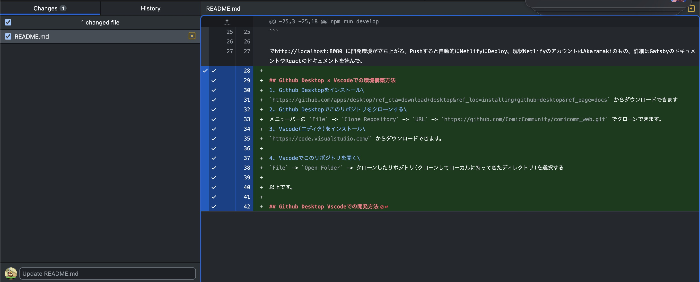

# Comic Community公式サイトレポジトリ
## 編集者用説明
各ページの文章 → content内の各markdownを編集すれば自動反映。

サークルカット → content/circlecut内。サークルごとにフォルダを作り、中に画像とmarkdownを配置。
画像の形式、サイズは気にせずディレクトリに入れれば勝手に圧縮して表示。
markdownはfrontmatterにname、本文に説明文を記述。以下例。
```markdown
---
name:"ここにサークル名"
---
以下サークル紹介。
```

サイトロゴ → static/images内のimagetopとhidariue。faviconはなんか反映できて~~ない~~いる。(localでは見えない)


## 開発者用説明
使用言語はTSとSCSS(CSSと互換あり)でJAMStac。静的サイトジェネレータGatsbyを使ってReactで書いたサイトをNetlifyでデプロイ。レポジトリをクローンして、
`npm install`で依存パッケージをインストールする。
もしそれでエラーが出た場合は，`npm audit fix --force` で脆弱性の問題の対処をすると解決する可能性がある．

```shell
npm run develop
```

でhttp://localhost:8080 に開発環境が立ち上がる。Pushすると自動的にNetlifyにDeploy。現状NetlifyのアカウントはAkaramakiのもの。詳細はGatsbyのドキュメントやReactのドキュメントを読んで。

## Github Desktop × Vscodeでの環境構築方法
1. Github Desktopをインストール\
`https://github.com/apps/desktop?ref_cta=download+desktop&ref_loc=installing+github+desktop&ref_page=docs` からダウンロードできます
2. Github Desktopでこのリポジトリをクローンする\
メニューバーの `File` -> `Clone Repository` -> `URL` -> `https://github.com/ComicCommunity/comicomm_web.git` でクローンできます。 
3. Vscode(エディタ)をインストール\
`https://code.visualstudio.com/` からダウンロードできます。

4. Vscodeでこのリポジトリを開く\
`File` -> `Open Folder` -> クローンしたリポジトリ(クローンしてローカルに持ってきたディレクトリ)を選択する

以上です。

## Github Desktop Vscodeでの開発方法
ここでは、方法論だけ説明しています。エンジニア的な思想や概念については、各自調べてください。

参考: 
- https://qiita.com/yasu_qita/items/3a24322f0ebdd443ba7e
- https://qiita.com/higakin/items/ead91bf04720f8eb07c0

### 概要
開発の流れとしては、以下のようになる。
1. リモートからcloneしてローカルにリポジトリを持ってくる (
[Github Desktop × Vscodeでの環境構築方法](#github-desktop-vscodeでの環境構築方法) にて完了想定)
2. mainを最新にした上でブランチを切る 
3. ファイルを編集、コミット
4. プッシュ
5. プルリクエストを出す


### ブランチを切る
Q. ブランチとは？: \
A. 枝分かれした開発の流れを管理するためのもの。これを使って複数人が作業していても衝突しないようにする。

バージョン管理システム(gitとか)を使って開発を行う場合、複数のブランチを使って開発を行うことが一般的。\
当リポジトリにおけるmainブランチは、リリースするバージョンを管理するブランチにしており、直接編集することは推奨されない。そのため、作業を行う際は、mainブランチから新しいブランチを切って作業を行う必要がある。

#### ブランチの切り方
1. Github Desktopを開いて、`Current Repository`をクローンしたリポジトリに設定する。
2. mainブランチを最新にする。\
`Repository` -> `Pull`をクリックする。
2. メニューバーの `Branch` -> `New Branch` で新しいブランチを切る。
3. ブランチ名を入力して、`Create Branch`をクリックする。
    - ブランチ名は、作業内容がわかりやすいようにすると良い。英語推奨(日本語だとブランチ名が正しく表示されないことがある)。
    - e.g. `your_name/update-top-page`, `fix-bug-hoge`, `feat/fugafuga-hogehoge-pi-yopiyo` など
4. ブランチが切り替わる。その状態でVscodeで作業を行う。

### ファイルの編集、コミット
1. Vscodeで適当にファイルを開いて、編集する。\
編集が終わったら、Github Desktopを開いて、`Changes`タブに移動する。\
`Changes`タブには、編集したファイルが表示されている。\
e.g. 

2. 適当な作業単位になったら、必要な変更にチェックを入れ、Summaryに作業内容を記入し`Commit to ${your-branch-name}`をクリックする。

3. `Push origin`をクリックすると、リモートリポジトリに変更が反映される。

### プルリクエストを出す
1. Github Desktopで、`Current Repository`をクローンしたリポジトリに設定する。
2. メニューバーの `Branch` -> `Create Pull Request` でプルリクエストを作成する。
3. プルリクエストのタイトルと本文を記入し、`Create Pull Request`をクリックする。
4. プルリクエストが作成される。

5. プルリクエストが作成されると、他の開発者がコードをレビューし、問題がなければmainブランチにマージされる。

### 理論を学習したい方へ
ｵｽｽﾒ: https://zenn.dev/masatotezuka/articles/0c561138491569