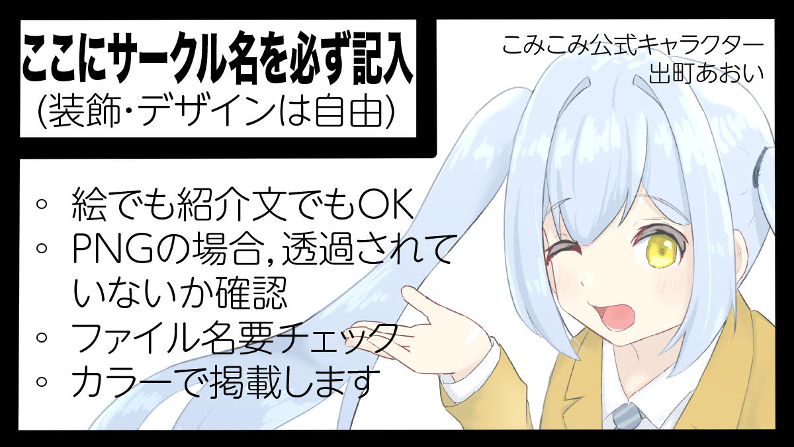

## お知らせ
サークル参加受付は締め切りました。たくさんのお申し込みありがとうございました。

## CC08開催概要

京都の学生による創作・批評活動の発展と交流，および文化系サークル合同の新歓を目的として，オールジャンル同人即売会「第8回Comic Community即売会(略称：CC08)」を開催します。

- 日時：11/21(金)~24(月祝)
- 場所：京都大学11月祭内

## 出展方式・開催スケジュール
出展方式は**直接頒布**（出展サークル様が会場の自スペースで直接頒布していただく方式）と**委託頒布**（スペースに見本を置き，委託ブースにて頒布物を一括で取り扱う方式）の2種類があります。各開催日によって出展可能な方式とスケジュールが異なりますので，あらかじめ以下の表でご確認ください。

| 日程 | 直接頒布 | 委託頒布 | サークル入場開始 | 撤収 |
| ---- | ---- | ---- | ---- | ---- |
| Day 1【11/21(金)】  | ◯ | × | 11:00 | 17:00 |
| Day 2【11/22(土)】  | ◯ | ◯ | 10:00 | 18:00 |
| Day 3【11/23(日)】  | ◯ | ◯ | 10:00 | 18:00 |
| Day 4【11/24(月祝)】  | ◯ | ◯ | 10:00 | 17:00 |

## 出展資格
サークル参加するには1種類以上の品目を頒布する必要があります。

## 頒布物
以下の頒布禁止物に該当しない限りで，同人誌，CD，ソフトウェア等全ての形態のものを頒布することができます。当日搬入時に，頒布物が頒布禁止物に該当しないか運営が確認し，該当すると判断した場合は基準に収まるような修正を指示，修正を行わない場合は頒布を禁止します。頒布物が頒布禁止物に該当するか判断に迷う場合は，運営にお問い合わせください。

### 頒布禁止物
- 飲食物，薬品，危険物
- 二次創作の作品の場合，版権元を著しく侵害する頒布物
- 古書，中古同人誌，海賊版同人誌，またはそれに類する頒布物
- 参加サークル名義とは異なる頒布物
- 犯罪行為を誘発する恐れのある頒布物
- その他法律・法令・条例に触れる頒布物すべて
- 京都大学11月祭の運営方針にそぐわない頒布物
- 当運営に頒布を許可されていない頒布物
- その他，当運営が不適切だと判断した頒布物

### 成人向け頒布物の頒布について
成人向け頒布物（過度なグロテスク/性的表現を含む頒布物）の頒布は禁止しません。ただし，直接頒布においては見本誌に黒いカバーをつけるなどの配慮，および年齢確認を出展者の責任で行ってください。委託頒布においてはフォームにて申告の上，運営からの指示に従ってください。その他詳細は、後日お伝えする成人向け頒布物ガイドラインをご参照ください。

## 参加費
各日1スペースあたりのサークル参加費は以下の表に示す通りです。

| 日程 | 直接頒布 | 委託頒布 | 
| ---- | ---- | ---- |
| Day 1【11/21(金)】  | ¥0 | – |
| Day 2【11/22(土)】  | ¥200 | ¥400 |
| Day 3【11/23(日)】  | ¥200 | ¥400 |
| Day 4【11/24(月祝)】  | ¥200 | ¥400 |

### ダブルスペース申込について
そのサークルに一般参加者が集中し頒布が大変になる，頒布物が多数あり1スペースでは収まらないなどの場合，2スペース申込むことが出来ます。参加費は上記の金額の2倍です。ダブルスペース申込を検討している方は申込時に選択してください。

## スペースについて
- 机サイズはサークル募集時点で未定ですが，昨年の11月祭企画CC06では縦35cm，横160cmでした。これを2分割して1スペース(35cm×80cm)として使用しました。
- 壁や床を使った掲示物の展示は禁止します。
- 当運営の許可なくビラなどを会場外に掲示する，配布するなどの行為は禁止します。
- 机に掲示物を取り付ける場合は養生テープを使用してください。
- 電源の利用は事前にご相談ください。
- 火気厳禁です。

## 抽選
直接頒布申込が多数の場合，抽選にて参加可能サークルを決定いたします。その際は抽選結果を，参加申込を行った各サークルの申込時に入力したメールアドレスに送信いたします。なお，抽選後の調整により繰り上げ当選を行う場合があります。

## サークルカット
参加サークルからサークルカットの提出をお願いします。
提出されたサークルカットは当運営のHP上で掲載するなどの広報活動に使用致します。

提出先は、上記の[参加登録フォーム](https://docs.google.com/forms/d/e/1FAIpQLSdg8H8qhYOUhHH9ykfp1CVXxcqpHvfBUETipsGJf4jLdKB5Eg/viewform)となっております。

### サークルカットのテンプレート

### 記入例

### 注意点
- 必ず**テンプレートをご使用ください。** テンプレートは登録フォームからもダウンロードできます。
- サークル名をサークルカット内に必ず入れてください。
- PNG形式で提出する場合は背景が透過されていないことを確認してください
- PNGまたはJPEG形式で，必ずファイル名を「サークル名_CC08」とした上でアップロードしてください。
- 基本的にカラー(RGB推奨，CMYK可)で掲載します。

## その他注意事項
### コスプレ売り子について
コスプレ衣装での売り子を希望される際は，当日に運営スタッフからの許可を受け，そこで配布する許可証を目に見えるところに提示してください。衣装については一般参加と同じ規定を遵守していただきます。

## 当日の流れ、諸注意
「一般参加の方へ」のページと合わせて参加当日までにご確認ください。下記事項に反した場合，頒布の禁止、退場などの措置を行うことがあります。その場合でも，参加費は返金いたしません。

### 搬入・設営
頒布物の搬入，撤収作業は当日に各サークルで行ってください。その際，京都大学や当運営宛てに郵送しないでください。
- 搬入時に，大学構内及びその近辺に宅配業者を呼ばないでください。
- 搬入設営開始時刻は参加日の午前10:00です。それ以前の搬入設営は原則禁止です。

### 撤営
- 頒布終了時刻および撤営完了時刻は17:00 (Day1, 4)または18:00 (Day 2, 3)です。この時間までに撤営完了できるように各団体は撤営作業を行ってください。
- 撤営時には運営にサークル参加証，コスプレ許可証，その他運営から借用したものを返却してください。
- 撤営時に，大学構内及びその近辺に宅配業者を呼ばないでください。
- ゴミは各サークルで持ち帰ってください。

### 参加費支払い
- 各サークルは参加費を、来場時に運営スペースにて現金でお支払いください。またその際に、サークル代表者の身分証を提示してください。フォームで入力した代表者が直接会場に来られない場合は連絡の上で代理を立てていただいてもかまいません。内部団体は学生証も提示してください。

### 会場について
- 会場内では美化に努めてください。

### スペースについて
- 常に最低1人以上店番を配置し，配布するサークル参加証を常に目に見えるところに提示してください。
- 当運営の許可のない会場内の撮影行為は禁止します。自スペースの写真を撮影する行為は禁止しませんが、他サークルおよび他の一般参加者とトラブルにならないよう配慮してください。

### その他
- 物品破損などが生じた場合，故意・過失にかかわらず，自己申告してください。場合によってはその参加サークルに賠償していただく可能性があります。
- 参加サークル同士および当日の入場者とのトラブルには注意してください。トラブルが起きた場合，当運営は一切責任を負いません。
- 会場内での貴重品の扱いには厳重に注意してください。盗難などの問題が発生した場合にも，当運営は一切責任を負いません。
- 会場内では運営スタッフの指示に従ってください。
- 各参加サークル様のSNSなどで「CC08」「こみこみ」「comicomm」などのハッシュタグをつけて拡散いただくと大変ありがたいです。ただし，画像の取り扱いなどプライバシーには十分配慮してください。
